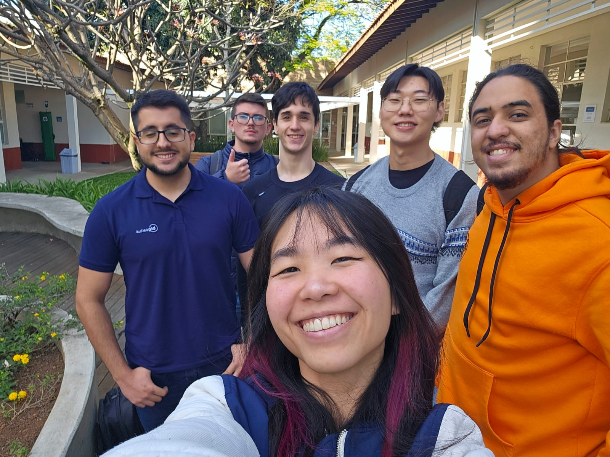

# Console Portátil (Vídeo demonstrativo na /docs)

## Descrição Geral
Este projeto tem como objetivo o desenvolvimento de um **console portátil de jogos** utilizando a **Raspberry Pi 3** como unidade principal de processamento.  
O console apresenta um **display LED de 7 polegadas**, **botões físicos de controle**, e roda um **jogo no estilo *Nanostray*** — um *shoot’em up* com temática espacial, onde o jogador controla uma nave e deve eliminar inimigos em sequência.

---

## Levantamento de Requisitos

### Requisitos
- O sistema deve inicializar automaticamente o jogo ao ser ligado.  
- O jogador deve conseguir interagir com o jogo por meio de botões físicos.  
- O display deve exibir o jogo em tempo real.  
- Deve existir uma forma de encerrar ou reiniciar o jogo.

---

## Delimitação do Escopo

O escopo do projeto foi definido de forma a abranger:
- Desenvolvimento de **hardware embarcado** simples, baseado na Raspberry Pi 3.  
- Criação de um **único jogo protótipo**, inspirado em *Nanostray*.  
- Implementação de controles físicos (botões direcionais e de ação).  

---

## Conjunto de Tecnologias

| Componente | Descrição | Função |
|-------------|------------|--------|
| **Raspberry Pi 3** | Microcontrolador com CPU ARM | Unidade principal de processamento |
| **Display LED 7”** | Tela de 7 polegadas | Exibição do jogo |
| **Botões físicos (GPIO)** | Conectados aos pinos GPIO da Raspberry Pi | Controle do personagem/jogo |
| **Linguagem Python** | Linguagem de programação utilizada | Desenvolvimento do jogo |
| **Biblioteca Pygame** | Framework para jogos em Python | Controle de renderização, entrada e som |

---

## Pesquisa e Interpretação de Documentação

Durante o desenvolvimento, foram analisadas as seguintes fontes técnicas:

- **Documentação da Raspberry Pi**  
  - [https://www.raspberrypi.com/documentation/](https://www.raspberrypi.com/documentation/)
  - Referência para configuração de GPIO e o display.

- **Documentação da biblioteca Pygame**  
  - [https://www.pygame.org/docs/](https://www.pygame.org/docs/)
  - Utilizada para controlar renderização gráfica e eventos dos botões.

Essas referências foram essenciais para compreender a comunicação entre o hardware e o software.

---

# Resultados e Considerações

O console portátil apresentou um desempenho satisfatório, conseguindo executar o jogo de forma fluida e com boa responsividade dos controles.  
O projeto demonstrou a viabilidade de utilizar uma Raspberry Pi como plataforma de jogos portáteis e serviu como base para aprofundar o entendimento sobre **microcontroladores, GPIO, integração de hardware e software embarcado.**

---

## Nomes e RAs
André Renato Almeida Abreu
RA:22.01255-9

Arthur Jin Woo Lee
RA:22.01519-0

Fernando Minharro Alves Gimenez 
RA:22.00833-0

Leonardo Henrique Dias Moura 
RA:21.01837-5

Leonardo Tagliati da Silva 
RA:22.00170-0

Michelle Mitie Hamazaki 
RA: 20.00539-3

<video controls src="docs/video.mp4" title="Title"></video>
